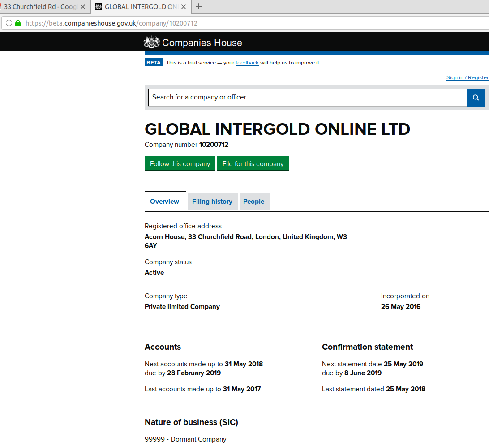
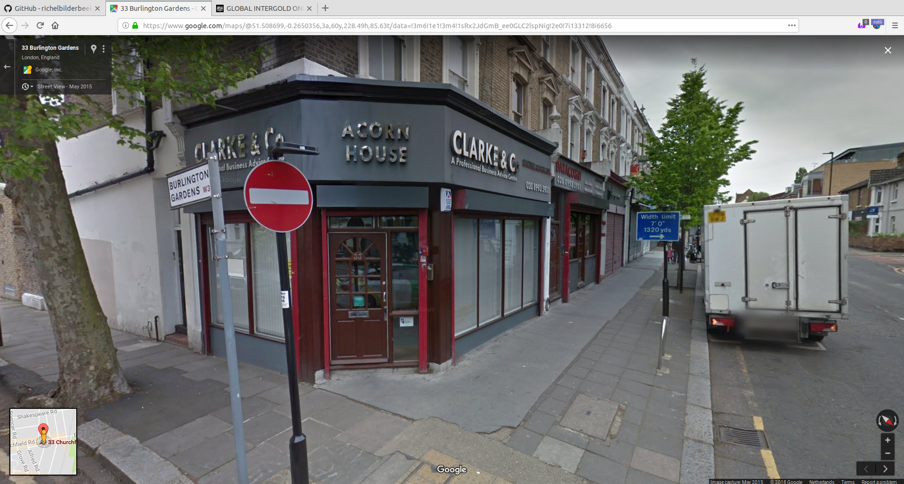

# InvestigateGlobalInterGold

My notes on Global InterGold.

## Registration at Companies House

One can find it here: [https://beta.companieshouse.gov.uk/company/09608201](https://beta.companieshouse.gov.uk/company/09608201).

The filing history shows, 

 * at 19 Oct 2016, there is one shareholder, Rubin Sipkoski. Rubin Sipkoski followed a Scientology course [1]
 * at July 11th 2017, the company was dissolved 

There is a new registration: [here](https://beta.companieshouse.gov.uk/company/10200712/filing-history )

[1]: http://www.truthaboutscientology.com/stats/by-name/r/rubin-sipkoski.html

## Main office

Office from [Google maps](https://www.google.com/maps/place/33+Churchfield+Rd,+London+W3+6EB,+UK/@51.508718,-0.2651283,3a,75y,177.97h,82.75t/data=!3m6!1e1!3m4!1sw2TxI4Wddd6vKJ73YC9RyA!2e0!7i13312!8i6656!4m5!3m4!1s0x48760e1be45b06d1:0x5aa24dd233690a6!8m2!3d51.508611!4d-0.2650749)

## Former main office

Address at former Chamber of commerce registration:

(note that the company is dissolved)

Office from [Google Maps](https://www.google.com/maps/@52.0392213,-0.7642793,3a,75y,310.03h,85.64t/data=!3m6!1e1!3m4!1s0-l268KzJh_qHdejEvoiUA!2e0!7i13312!8i6656):

## GIG-OS location

I found the address of GIG-OS at [https://gig-os.com/en/contacts](https://gig-os.com/en/contacts):

> Contact details at [https://gig-os.com/en/contacts](https://gig-os.com/en/contacts)

Going to [Google Streetview](https://www.google.com/maps/@42.6994446,23.3174282,3a,51.3y,282.54h,90.28t/data=!3m7!1e1!3m5!1somTYiT8Seg0Qqiql-EzWZQ!2e0!6shttps:%2F%2Fstreetviewpixels-pa.googleapis.com%2Fv1%2Fthumbnail%3Fcb_client%3Dmaps_sv.tactile%26w%3D900%26h%3D600%26pitch%3D-0.2797572397127084%26panoid%3DomTYiT8Seg0Qqiql-EzWZQ%26yaw%3D282.5422412666633!7i16384!8i8192?coh=205410&entry=ttu&g_ep=EgoyMDI0MTAyNy4wIKXMDSoASAFQAw%3D%3D),
here is how the residence looks like:

## Are there any signs that GIG is a MLM-based pyramid scheme?

List from [Bosley & McKeage, 2015]:

 * Little/no demonstrated company revenue from retail sales to public (sales to those outside the MLM program): Agree
 * Participant income primarily derived from recruitment rates than sales of products: Agree
 * Sales pitch emphasizes recruiting: Agree
 * Excessive earnings claims or promises of high returns in a short time period: Agree
 * Product is unproven and/or unfairly priced: Undescided, as I can agree ('The gold is not the product, so what *is*?') and disagree ('The gold has a fair price')
 * Buy-in required: Agree, costs 275 euro's
 * Vast majority of participants lose money: Unknown
 * No information of potential expenses (in writing): Unknown
 * Consumer complaints (from other regions or prioir waves): Agree
 * High turnover of past participants: Unknown
 * Exponential growth in participation: Unknown
 * Messages of easy money or passive income: Agree, passive money is earned from the Leadership Program
 * Complex commission structure: Agree, the tables are complex to understand in full detail, the Leadership Project plan is simpler
 * Required inventory purchases: Undecided, as I can agree ('Your money is automatically converted to gold'), and disagree ('Your money simply loses value when tranferring from GIG account to your bank')
 * Mandatory purchases (beyond want or need) to stay in good standing: Agree, there is social pressure for participants to keep filling tables
 * No clear refund policy (in writing): Disagree
 * Past legal action against the company: Agree
 * Rapid decline in participation: Unknown
 * Growth in participation despite recession: Unknown
 * High participation in economically depressed regions: Unknown

This brings the list to:

 * Agree: 10x
 * Disagree: 1x
 * Undescided: 2x
 * Unknown: 7x

For comparison, this is about the now-terminated MyClickWinners:

 * Agree: 7x
 * Disagree: 2x
 * Undescided: 3x
 * Unknown: 8x

## References

 * [Bosley & McKeage, 2015] Bosley, Stacie, and Kim K. McKeage. "Multilevel Marketing Diffusion and the Risk of Pyramid Scheme Activity: The Case of Fortune Hi-Tech Marketing in Montana." American Marketing Association, 2015.
